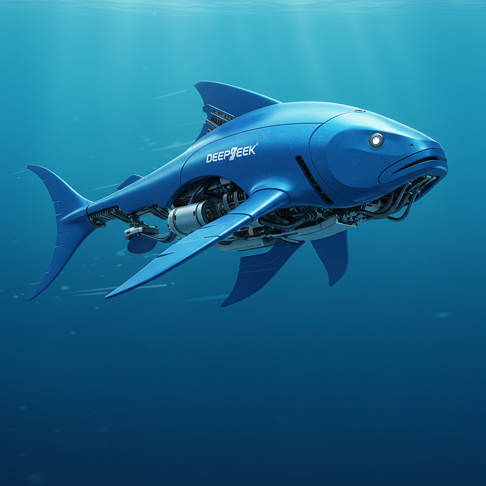

# DeepTube - AI-Powered YouTube Strategy Assistant

<div align="center">
  
  <br>
  <h3>Elevate your YouTube content with AI-powered insights</h3>
  
  [](https://deeptube-production.up.railway.app/)
  
  [](https://github.com/Waqas-Baloch99/DeepTube)
  [](https://www.python.org/)
  [](https://www.djangoproject.com/)
  [](https://getbootstrap.com/)
  [](LICENSE)
</div>

## 🚀 Overview

DeepTube is a comprehensive Django-based web application that leverages the power of AI to help content creators optimize their YouTube strategy. From content ideation to trend analysis, DeepTube provides a suite of tools to enhance your YouTube presence and grow your channel.

## 🌐 Live Demo

Try DeepTube without installation:
### [https://deeptube-production.up.railway.app/](https://deeptube-production.up.railway.app/)

Experience all features including:
- AI chat assistant for YouTube strategy advice
- Script generation for video content
- YouTube analytics and trend tracking
- Voice input capabilities

## ✨ Features

<div align="center">
  <table>
    <tr>
      <td align="center" width="33%">
        <br />
        <b>AI Chat Assistant</b><br />
        Get personalized YouTube strategy advice
      </td>
      <td align="center" width="33%">
        <br />
        <b>Script Generation</b><br />
        Create video scripts with AI
      </td>
      <td align="center" width="33%">
        <br />
        <b>YouTube Analytics</b><br />
        Track trends and insights
      </td>
    </tr>
    <tr>
      <td align="center">
        <br />
        <b>Voice Input</b><br />
        Interact using voice commands
      </td>
      <td align="center">
        <br />
        <b>Responsive Design</b><br />
        Works on all devices
      </td>
      <td align="center">
        <br />
        <b>Dark Mode</b><br />
        Automatic system preference detection
      </td>
    </tr>
  </table>
</div>

## 🛠️ Technologies Used

<div align="center">
  <table>
    <tr>
      <td align="center" width="20%">
        <br />
        <b>Django 4.2+</b>
      </td>
      <td align="center" width="20%">
        <br />
        <b>Python 3.9+</b>
      </td>
      <td align="center" width="20%">
        <br />
        <b>Bootstrap 5</b>
      </td>
      <td align="center" width="20%">
        <br />
        <b>JavaScript</b>
      </td>
      <td align="center" width="20%">
        <br />
        <b>RESTful APIs</b>
      </td>
    </tr>
  </table>
</div>

### API Integrations

- **[YouTube Data API v3](https://developers.google.com/youtube/v3)**: For fetching trending videos, analytics, and channel data
- **[Groq Cloud](https://console.groq.com/)**: For advanced LLM capabilities powering the AI assistant and content generation

## 📋 Prerequisites

- Python 3.9 or higher
- pip (Python package manager)
- Virtual environment (recommended)
- Git
- YouTube API key
- Groq API key

## 🚀 Installation

1. **Clone the repository**

```bash
git clone https://github.com/Waqas-Baloch99/DeepTube.git
cd DeepTube

